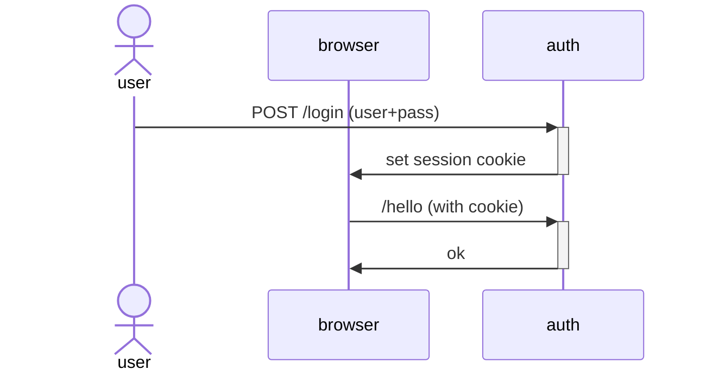

# Auth using Biscuit

> Example application using biscuit

## Endpoints

1. `/login` -> authenticate and receive a biscuit token in a cookie
1. `/register` -> create user
1. `/is_auth` -> returns 401 when no token present, 403 invalid creds or 200

## Usage

1. Clone this repo
1. Run `cargo run`
1. Go to [rest.http](./rest.http) (In VSCode you'll the [Rest Client Extension](https://marketplace.visualstudio.com/items?itemName=humao.rest-client))
1. Use the queries

## Login workflow

## TODO:

- [ ] Improve error messages
- [ ] Add `.well-known/` endpoint with pub key
- [ ] Add `is_admin` endpoint, use RBAC example for this
- [ ] Add `is_anon` endpoint