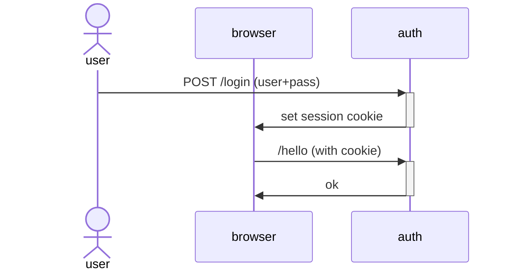

# Auth using Biscuit

> Example application using biscuit

## Endpoints

1. `.well-known/` -> information
1. `login` -> authenticate and receive a biscuit token in a cookie
1. `validate` -> check if token is valid
1. `register` -> create user
1. `test/is_auth` -> returns 401 when no token present, 403 invalid creds or 200
1. `test/is_anon` -> returns always 200
1. `test/anon_and_auth` -> returns user if auth

## Login workflow

## Notes on biscuit

1. never build datalog snippets by concatenating strings, prefer macros with parameters: biscuit!(r#"user({username})"#, username = self.username).
Using strings directly is susceptible to injections exactly like in SQL
2. before querying the username, you still need to authorize the request (with allow if user($u)
